# 小嘉智能环境监控系统

目录

- [1 项目概述](#1-项目概述)
  - [1.1 项目背景](#11-项目背景)
  - [1.2 项目目标](#12-项目目标)
- [2 需求分析](#2-需求分析)
  - [2.1 功能需求](#21-功能需求)
  - [2.2 非功能需求](#22-非功能需求)
  - [2.3 用户界面需求](#23-用户界面需求)
  - [2.4 接口需求](#24-接口需求)
- [3 系统设计](#3-系统设计)
  - [3.1 系统架构设计](#31-系统架构设计)
  - [3.2 模块设计](#32-模块设计)
  - [3.3 数据存储方案](#33-数据存储方案)
  - [3.4 接口设计](#34-接口设计节选)
- [4 功能实现](#4-功能实现)
- [5 核心算法设计](#5-核心算法设计)
  - [5.1 消息发布模块](#51-消息发布模块)
  - [5.2 消息订阅模块](#52-消息订阅模块)
  - [5.3 智能分析模块](#53-智能分析模块)
- [6 软件说明](#6-软件说明)
  - [6.1 开发环境](#61-开发环境)
  - [6.2 项目结构](#62-项目结构)
  - [6.3 部署示意](#63-部署示意)
  - [6.4 时序示意](#64-时序示意)
- [7 附录](#7-附录)

## 1 项目概述

### 1.1 项目背景

在同济大学嘉定校区，环境舒适度对同学们的学习和生活有着直接的影响。然而，当前获取教学楼、图书馆等地方的温度、湿度等环境信息的方式却不够直观便捷，导致诸如“今天自习室是否闷热？”、“梅雨季节图书馆是否会返潮？”等问题得不到及时解答。这些环境监测数据通常以枯燥的数字形式呈现，缺乏与校园具体场景的有效结合，难以被广大学生快速理解和应用。

为了解决这一问题，我们开发了名为 “小嘉” 的环境数字助手。作为一款基于模拟传感器数据（包括温度、湿度、气压等）并通过 MQTT 协议实现数据发布与订阅的应用，“小嘉”致力于将环境数据转化为对学生日常生活有实际意义的信息。通过本地 GUI 界面进行数据可视化与智能解读，“小嘉”不仅能够展示实时的环境状况，还能根据特定模型分析出该环境下是否适宜学习或活动，并给出相应的建议。

### 1.2 项目目标

* 基于模拟传感器数据（温度、湿度、气压），通过 MQTT 发布/订阅链路和本地可视化，将环境数据转化为可理解、可行动的舒适度信息；
* 提供实时数据、趋势分析与建议，帮助学生快速判断“可否安心自习/阅读”；
* 支持多主题/多楼宇扩展，便于后续真实传感器接入。

## 2 需求分析

### 2.1 功能需求

- 消息发布模块：
  - 读取历史/模拟数据，对齐时间序列，按可配置间隔发布到指定 MQTT Broker；
  - 支持日期过滤、断点续传、停止/重置；
  - 运行中提供发布进度、当前时间戳、累计发布/跳过计数，并可更换 Broker/认证参数以适应多环境。
- 数据订阅模块：
  - 连接指定 Broker，订阅多类传感器主题，实时存储并统计计数；
  - 通过 WebSocket 将最新数据、累计计数、最近消息时间推送前端；
  - 支持取消订阅、切换主题、断线重连与状态查询。
- 智能分析模块：
  - 对存储数据做趋势、预测或统计分析，输出可视化/预测数据接口；
  - 支持线性/多项式拟合、移动平均、统计指标，未来可扩展阈值规则和分类模型用于舒适度标签。

### 2.2 非功能需求

- 可扩展：新增传感器类型需最小改动。
- 可用性：
  - 前后端本地一键启动；
  - 接口错误信息包含 code/message 便于定位；
  - 前端显示连接状态、数据新鲜度、最近消息时间，用户可快速判断链路健康度。
- 性能：本
  - 地单机支撑秒级发布/订阅与实时渲染；
  - WebSocket 低延迟推送；
  - ECharts 支持 1k+ 点级平滑渲染，适用于常见实时看板需求。
- 可靠性：
  - 发布可停止/重置，订阅断线自动重连，支持重新连接 Broker。
  - 发布/订阅异常前端有显式提示，后台日志记录异常原因。
- 可扩展性：新传感器主题新增后仅需在前端注册显示和在订阅端添加存储规则，Broker/端口可配置。

### 2.3 用户界面需求

- 监控页：
  - 实时曲线、数值卡片、在线状态、舒适度表情/提示，可同时展示温/湿/压曲线；
  - 若数据中断，显示数据新鲜度和重连提示。
- 发布控制：
  - 输入 Broker、时间范围、间隔、开始/停止、进度查看，显示当前发送时间戳、累计发布/跳过数量、预计剩余时长；
  - 支持重置进度与修改间隔。
- 订阅控制：
  - 输入 Broker/主题，启动/停止订阅，查看实时数据与统计；
  - 显示最近消息时间、总计数、订阅状态；可切换主题或断开重连。

### 2.4 接口需求

- REST：FastAPI 提供发布控制、订阅控制、分析与统计接口，返回 JSON，错误包含 code/message/trace 片段便于前端提示和调试。
- WebSocket：发布状态推送、订阅数据推送，前端保持长连接并在断线时自动重连；心跳基于消息更新频率。
- MQTT：主题分发，支持用户名/密码配置，可切换 Broker/端口；消息主题可按传感器类型或楼栋分层命名，便于扩展。

## 3 系统设计

### 3.1 系统架构设计

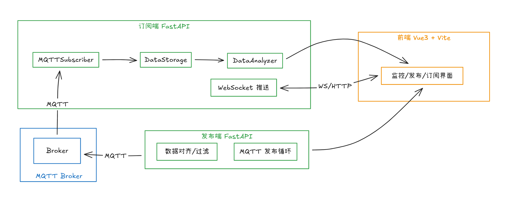

### 3.2 模块设计

- UI 框架设计：
  - Vite + Vue 3 + Vue Router，组件化卡片+图表；
  - 主布局在 xiaojia/src/layouts/MainLayout.vue，路由在 xiaojia/src/router/index.js，监控页在 xiaojia/src/pages/MonitorPage.vue，服务调用在 services/*；
  - ECharts 配置封装在监控页，支持按需注册图表组件。
- 发布模块设计：
  - MQTTConfig/PublishRequest 模型，数据对齐与日期过滤，循环按间隔发布；
  - 状态管理记录 total/published/skipped/progress/current_timestamp；
  - 支持停止/重置与断点续传；
  - MQTT 客户端 on_connect/on_publish 回调打印连接与发布结果，见 xiaojia/backend/main.py。
- 订阅模块设计：
  - MQTTSubscriber 负责连接与回调，DataStorage 落库（JSON/文本），DataAnalyzer 做统计与预测；
  - 主进程用 asyncio 协调，WebSocket 广播最新数据与累积计数，见 xiaojia/backenddata/main.py 与 xiaojia/backenddata/tools/*；
  - 回调线程安全地把消息转入事件循环，避免线程竞态。
- 分析模块设计：
  - 线性/多项式拟合、移动平均、趋势和统计指标，支持参数化窗口与多项式次数，输出结构化 JSON 供前端展示；
  - 可扩展更多模型（如 Prophet/LSTM）以提升预测能力。

### 3.3 数据存储方案

- 发布端：读取本地 data/*.txt 作为模拟源，可按日期过滤后对齐三类传感器时间戳。无需外部数据库，便于演示和离线运行。
- 订阅端：存储到 backenddata/data 下的 JSON/文本文件，按传感器分类，便于后续离线分析。

### 3.4 接口设计（节选）

- 发布端（默认 8001）
  - POST /publish/start：启动发布，若已有任务运行则返回 400。
  - POST /publish/stop：停止当前任务，立即更新状态。
  - POST /publish/reset：重置进度与缓存，需在未发布时调用。
  - GET /publish/status：返回发布计数、跳过计数、进度、当前时间戳。
  - WS /ws/status：实时推送状态，前端可用于进度条与提示。
- 订阅端（示例 8002，可配置）
  - POST /mqtt/connect：连接 Broker，若已存在连接则先断开再重连。
  - POST /mqtt/subscribe：订阅传感器主题列表，若未连接会返回错误；可多次调用追加主题。
  - POST /mqtt/unsubscribe：取消订阅指定主题。
  - GET /stats/summary：获取存储统计（条数、最近时间等）。
  - POST /analyze/run：执行分析/预测，body 含 sensor_type、起止日期、预测时长、阶数、方法列表。
  - WS /ws/data：推送最新数据与计数，含 type=data/status 区分消息类型。

## 4 功能实现

- 发布页（PublisherPage）：
  - 表单配置发布间隔/起始索引/过滤日期，按钮控制启动、停止、重置；
    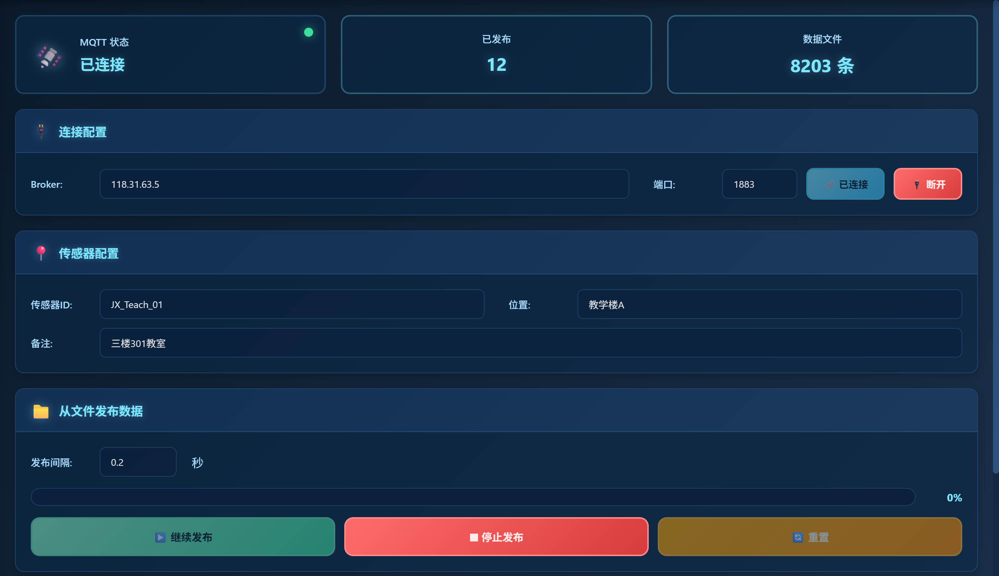
  - 实时展示已发布/跳过条数、进度百分比、当前时间戳，状态条自动刷新。
    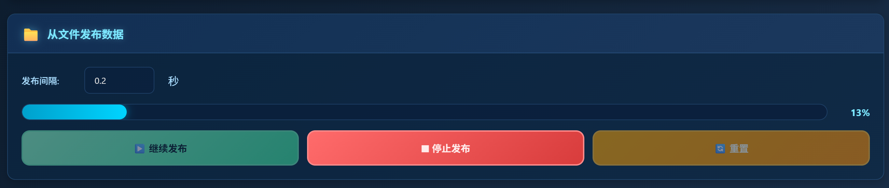
    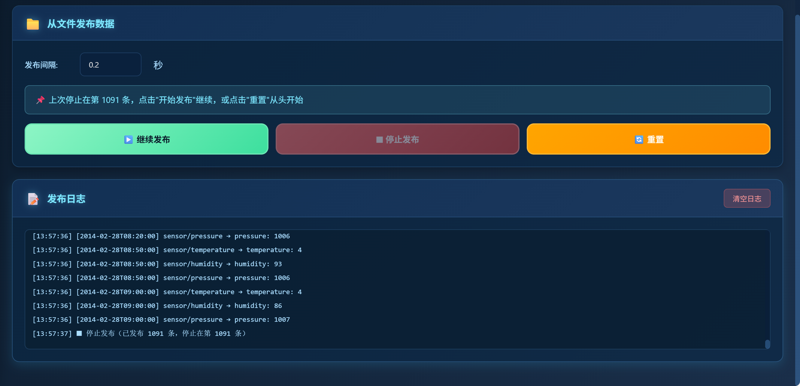
- 订阅页（SubscriberPage）：
  - 支持输入 Broker/主题并执行连接、订阅、退订，连接状态提示；
  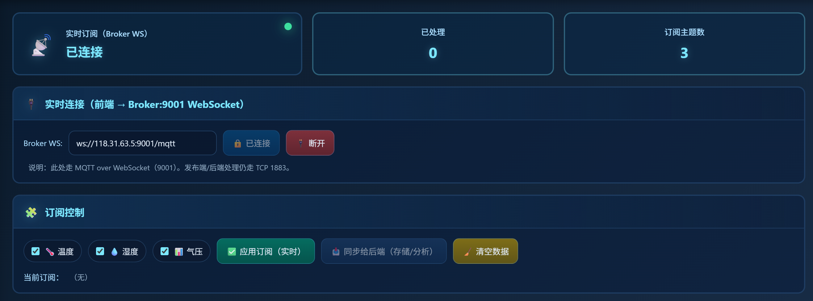
  - 显示地图和位置信息；
  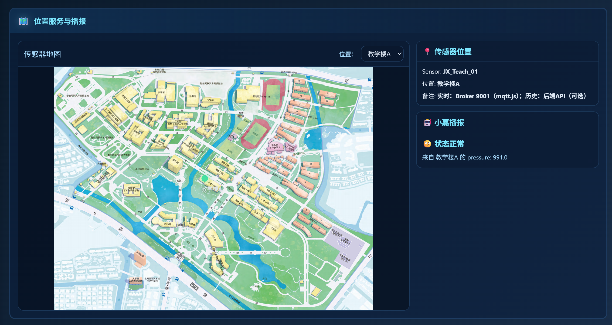
  - 实时列表/卡片呈现最新温度、湿度、气压与累计计数，以及接收日志。
  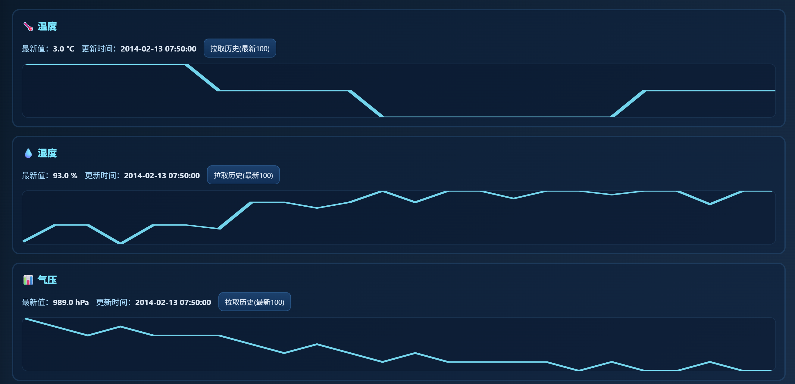
  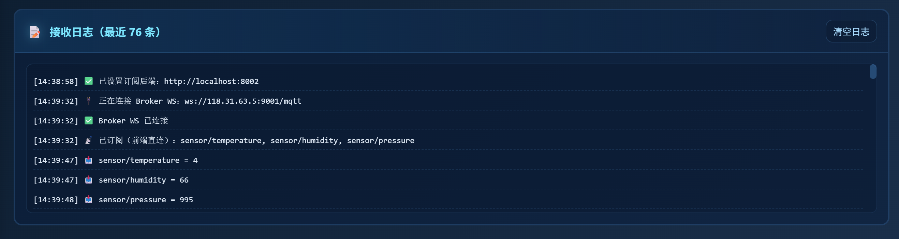
- 数据分析页（MonitorPage）：
  - ECharts 折线/柱状图显示实时/历史曲线，卡片显示最新值与舒适度计算结果；
  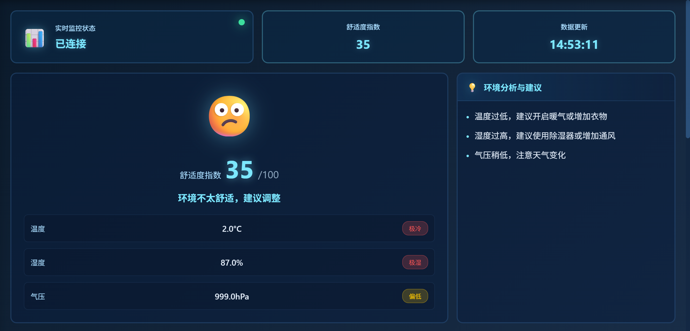
  - 支持选择传感器、时间范围，展示统计指标（均值/方差/极值）与趋势预测结果。
  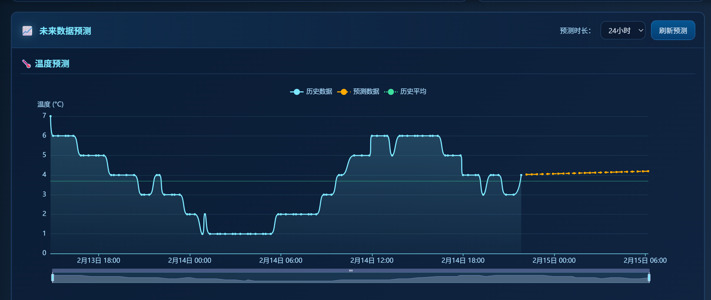
  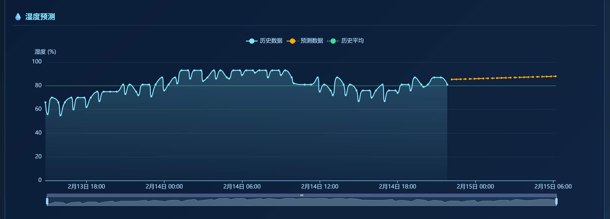
  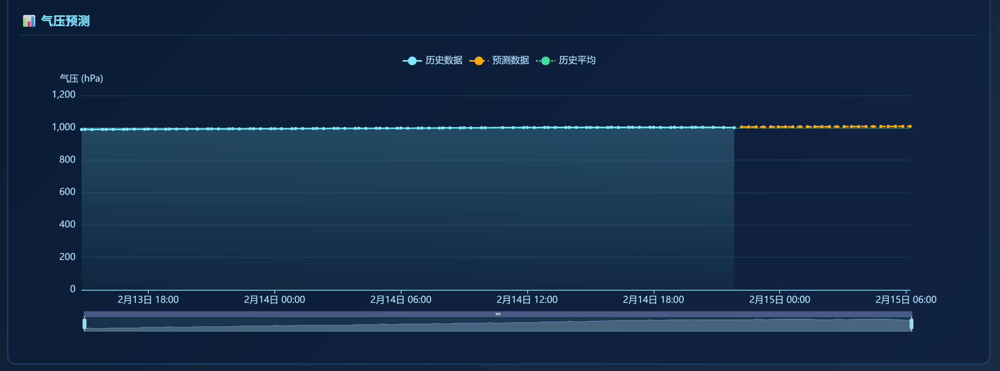
## 5 核心算法设计

### 5.1 消息发布模块：

- 数据对齐：

  - 对温度/湿度/气压时间戳取交集并排序，支持日期过滤；
  - 生成 aligned list，保证每条消息包含三类传感器值。
- 发布循环：

  - 按间隔发送，记录 published_count、skipped_count、progress、current_timestamp；
  - 支持停止与断点续传，从 current_index 继续；MQTT on_publish 回调打印发布成功。

```python
    async def publish_sensor_data(data: List[Dict], interval: float, start_index: int = 0, ...):
      if not state.mqtt_client:
        raise Exception("未连接到MQTT Broker")

      state.is_publishing = True
      state.should_stop = False
      state.status.total_records = len(data)

      if start_index == 0:
        state.status.published_count = 0
        state.status.skipped_count = 0

      for i in range(start_index, len(data)):
        if state.should_stop:
          break

        item = data[i]
        payload = {
          "timestamp": item["timestamp"],
          "temperature": item.get("temperature"),
          "humidity": item.get("humidity"),
          "pressure": item.get("pressure"),
          "sensor_id": sensor_id,
          "location": location,
          "extra": extra
        }

        for k in ["temperature", "humidity", "pressure"]:
          topic = f"/sensors/{k}"
          state.mqtt_client.publish(topic, json.dumps({
            "timestamp": item["timestamp"],
            "value": item[k]
          }))

        state.status.published_count += 1
        state.status.current_timestamp = item["timestamp"]
        state.status.progress = state.status.published_count / state.status.total_records
        state.current_index = i + 1

        await broadcast_status()
        await asyncio.sleep(interval)
```

    - 支持停止与断点续传，从 current_index 继续；
    - MQTT on_publish 回调打印发布成功。

### 5.2 数据订阅模块：

- MQTT 回调线程安全转交 asyncio 事件循环；

```python
def on_data_received(data: Dict):
    topic = data.get('topic', '')

    save_data = {
       "timestamp": data.get("timestamp", datetime.now().isoformat()),
       "topic": topic,
       "value": data.get("value")
    }

    if state.data_storage:
       state.data_storage.save_data(save_data)

    if topic:
       topic_key = topic.split('/')[-1] if '/' in topic else topic
       if topic_key in state.status.total_received:
         state.status.total_received[topic_key] += 1

    if state.event_loop and not state.event_loop.is_closed():
       asyncio.run_coroutine_threadsafe(broadcast_data(data), state.event_loop)
```

- 按主题聚合计数；
- WebSocket 广播当前统计与最新数据，自动移除断开连接；

```python
async def broadcast_data(data: Dict):
     message = {"type": "data", "data": data, "statistics": state.status.total_received}
     disconnected = []
     for ws in state.websocket_clients:
       try:
         await ws.send_json(message)
       except:
         disconnected.append(ws)
     for ws in disconnected:
       state.websocket_clients.remove(ws)
```

- 记录 topic 后缀作为统计键，便于多传感器并行。

### 5.3 智能分析模块：

- 输入与预处理：
  - 读取存储的时间序列（温/湿/压），可按日期过滤；
  - 对缺失值做跳过或插值，对时间排序并裁剪到分析窗口。
- 线性回归：以时间索引拟合一次多项式，获得趋势斜率与截距，输出未来 predict_hours 的线性外推，适合近似线性变化场景。

```python
def linear_regression_analysis(self, df: pd.DataFrame, predict_hours: int = 24) -> Dict:
    if df.empty or len(df) < 2:
      return {"error": "数据不足，无法进行分析"}

    time_indices, values = self.prepare_time_series(df)
    X = time_indices.reshape(-1, 1)
    y = values

    model = LinearRegression()
    model.fit(X, y)

    y_pred = model.predict(X)
    r_squared = model.score(X, y)
    mse = np.mean((y - y_pred) ** 2)
    rmse = np.sqrt(mse)
    mae = np.mean(np.abs(y - y_pred))

    last_time = time_indices[-1]
    time_interval = time_indices[1] - time_indices[0] if len(time_indices) > 1 else 3600
    future_predictions = []
    future_times = []
    for i in range(1, predict_hours + 1):
      future_time = last_time + i * time_interval
      future_times.append(future_time)
      future_pred = model.predict([[future_time]])[0]
      future_predictions.append(float(future_pred))

```

- 多项式拟合：
  - 可配置阶数（polynomial_degree），用最小二乘拟合曲线，生成未来预测点序列；
  - 阶数越高拟合越灵活但过拟合风险升高，建议 2~3 阶用于平滑曲线。

```python
def polynomial_regression_analysis(self, df: pd.DataFrame, degree: int = 2, predict_hours: int = 24) -> Dict:
    if df.empty or len(df) < degree + 1:
        return {"error": f"数据不足，至少需要{degree + 1}个数据点"}

    time_indices, values = self.prepare_time_series(df)
    poly_features = PolynomialFeatures(degree=degree)
    X_poly = poly_features.fit_transform(time_indices.reshape(-1, 1))

    model = LinearRegression()
    model.fit(X_poly, values)
    y_pred = model.predict(X_poly)

```

- 移动平均：对原始序列做窗口平滑（窗口大小可配），降低瞬时噪声，常用于前端展示的平滑曲线与短期趋势判断。

```python
def moving_average_analysis(self, df: pd.DataFrame, window: int = 10, predict_hours: int = 24) -> Dict:
    if df.empty or len(df) < window:
        return {"error": f"数据不足，至少需要{window}个数据点"}

    values = df['value'].values
    ma_values = pd.Series(values).rolling(window=window, center=True).mean().values

    recent_trend = np.mean(np.diff(values[-window:])) if len(values) >= window else 0
    last_value = values[-1]
    future_predictions = [float(last_value + recent_trend * i) for i in range(1, predict_hours + 1)]

```

- 统计特征：
  - 计算均值、方差、最大/最小值、最新值，用于提示稳定性和波动范围；
  - 可输出“过去 N 小时均值”“峰谷差”。
- 舒适度规则（可扩展）：
  - 基于温湿度阈值或热舒适经验区间（如温度 20~26℃、湿度 40%~65%）给出“舒适/偏热/偏潮”等标签；
  - 可根据分析结果附带行动建议（开窗/除湿/补水）。

```python
def comfort_eval(self, temp: float, humi: float) -> Dict:
    # 简化的热舒适区间判定，可根据实际需求调整
    comfort = "舒适"
    advice = "保持当前环境"

    if temp > 28 or humi > 75:
        comfort = "偏热/潮"
        advice = "建议降温或除湿，保持通风"
    elif temp < 18 or humi < 30:
        comfort = "偏冷/干"
        advice = "注意保暖与补水"
    elif temp > 26 and humi > 65:
        comfort = "略闷"
        advice = "适当通风，降低湿度"
    return {"comfort": comfort, "advice": advice}
```

- 输出格式：统一返回结构化 JSON，包含原始序列、平滑序列、预测序列、统计特征与舒适度标签，便于前端直接渲染曲线和提示。

## 6 软件说明

### 6.1 开发环境

- Windows；
- Node 18+/npm；
- Python 3.12+；
- Vite 5，Vue 3；
- FastAPI；
- MQTT Broker（部署在服务器上，公网IP: 118.31.63.5:1883）。

### 6.2 项目结构

- 前端：xiaojia/src
- 发布后端：xiaojia/backend
- 订阅后端：xiaojia/backenddata

项目树形示意：

```
IoT_Final_Project_TJ/
├─ PROJECT_DOCUMENT.md
├─ image/PROJECT_DOCUMENT/架构图.png
├─ mqtt-server/
│  └─ Readme.md
└─ xiaojia/
  ├─ package.json
  ├─ vite.config.js
  ├─ public/
  ├─ src/
  │  ├─ main.js
  │  ├─ App.vue
  │  ├─ assets/styles/global.css
  │  ├─ layouts/MainLayout.vue
  │  ├─ router/index.js
  │  ├─ pages/ (MonitorPage.vue, PublisherPage.vue, SubscriberPage.vue)
  │  ├─ components/ (MiniCard.vue, StatusCard.vue)
  │  └─ services/ (publisherService.js, subscriberService.js)
  ├─ backend/
  │  ├─ main.py
  │  ├─ requirements.txt
  │  └─ data/ (temperature.txt, humidity.txt, pressure.txt)
  └─ backenddata/
    ├─ main.py
    ├─ requirements.txt
    ├─ requirements_minimal.txt
    ├─ tools/ (data_analyzer.py, data_handler.py, mqtt_subscriber.py)
    └─ data/ (temperature.json, humidity.json, pressure.json, sensor_data.json)
```

### 6.3 部署示意

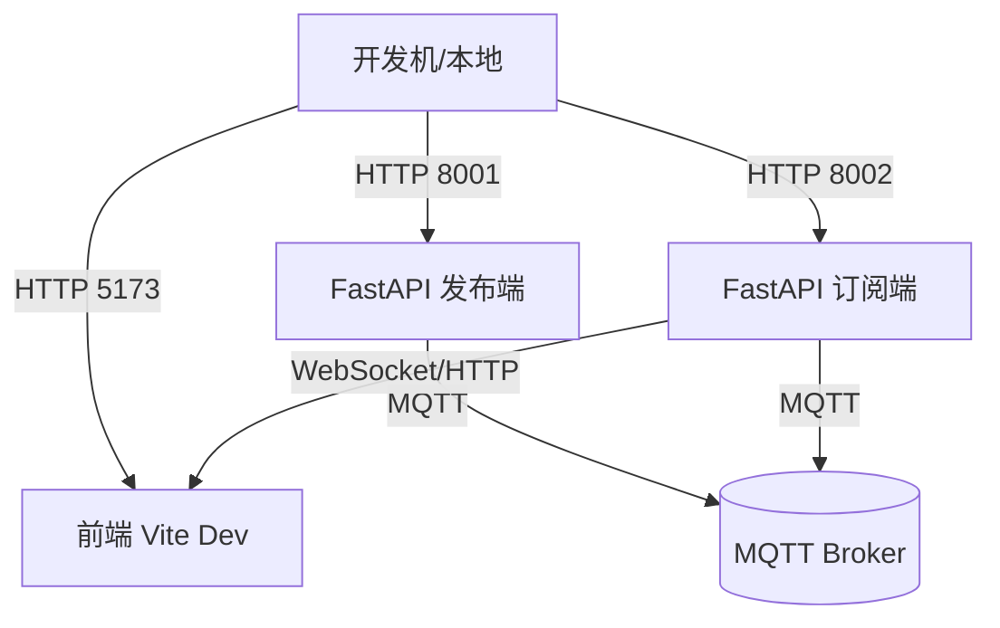

### 6.4 时序示意

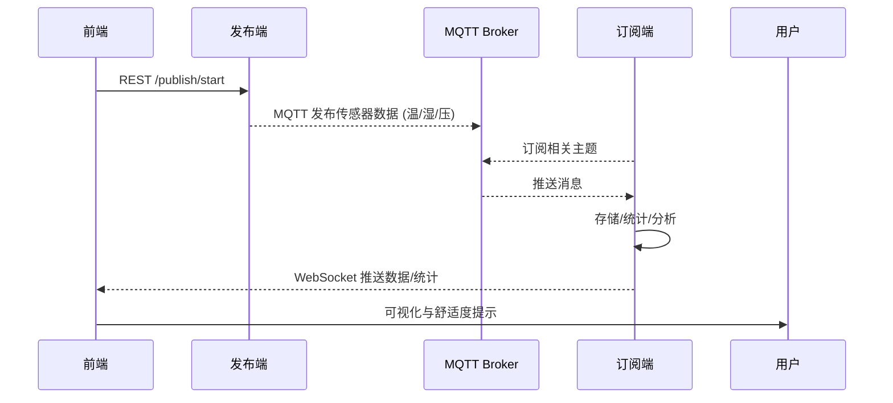

## 7 附录

- 参考资料：
  - MQTT 协议：https://mqtt.org
  - FastAPI 文档：https://fastapi.tiangolo.com
  - Paho MQTT Python 客户端：https://www.eclipse.org/paho/index.php?page=clients/python/index.php
  - scikit-learn 文档（回归/特征生成）：https://scikit-learn.org/stable/
  - SciPy 文档（统计与拟合）：https://docs.scipy.org/doc/scipy/
  - Pandas 文档（时间序列处理）：https://pandas.pydata.org
