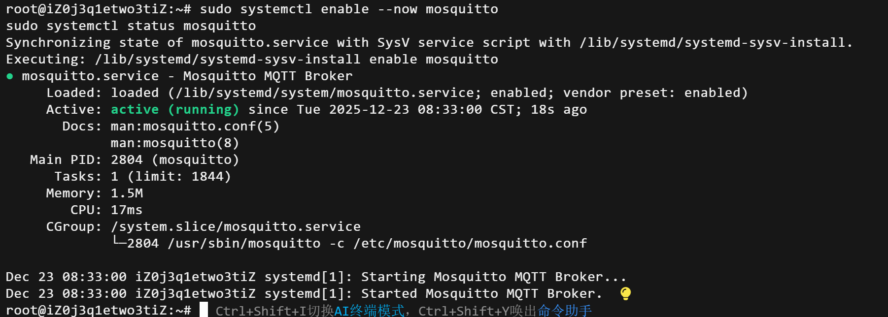
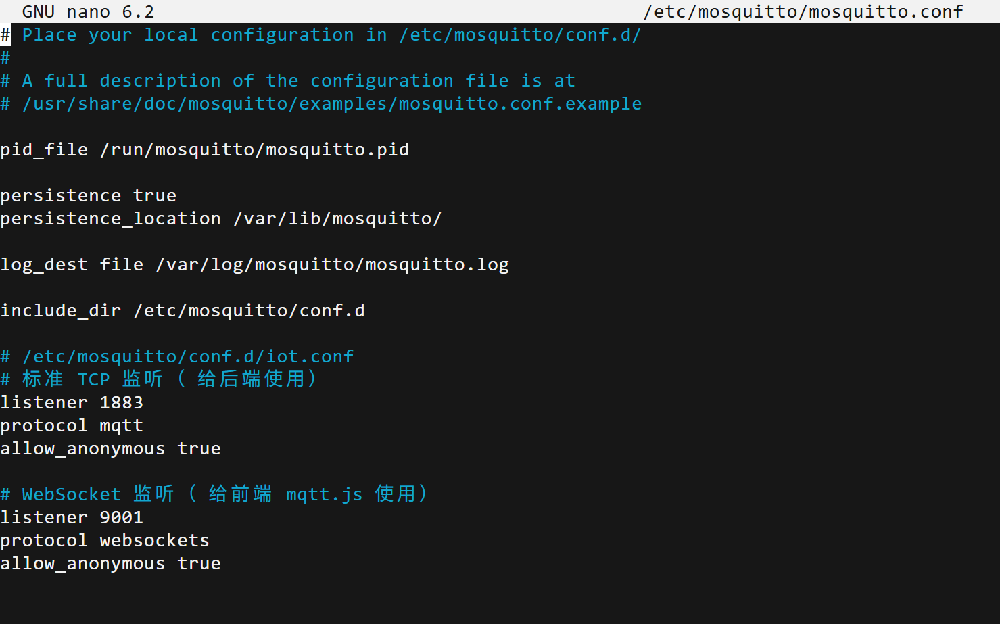
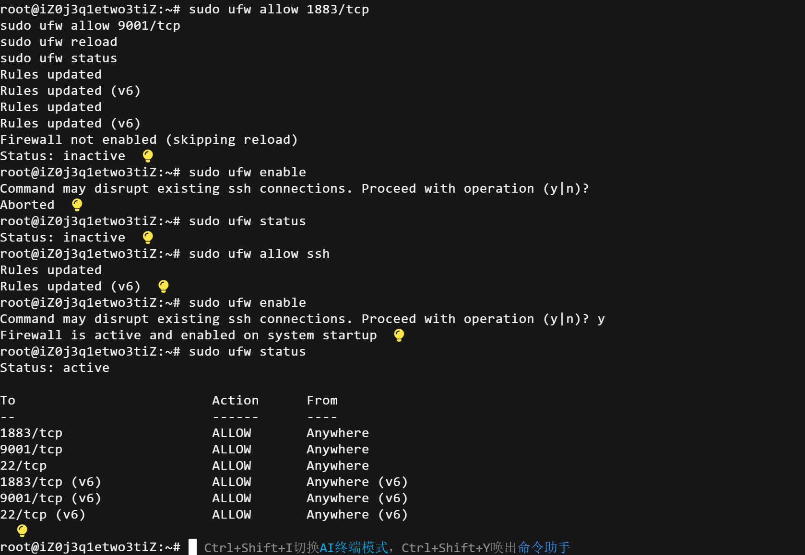

## MQTT 服务端

### 在服务器上部署 MQTT 服务
#### 配置 Mosquitto：
```bash
sudo apt update
sudo apt install mosquitto mosquitto-clients -y
sudo systemctl start mosquitto
sudo systemctl enable mosquitto
sudo systemctl status mosquitto
```


#### 修改 /etc/mosquitto/mosquitto.conf 文件：
```bash
sudo nano /etc/mosquitto/mosquitto.conf
```


#### 重启 Mosquitto 服务：
```bash
sudo systemctl restart mosquitto
```

#### UFW 防火墙配置
* 开放必要的端口：
```bash
sudo ufw allow 1883/tcp    # MQTT 默认端口
sudo ufw allow 9001/tcp    # 可选管理端口
sudo ufw allow 22/tcp      # SSH 必须开放
```
* 启用防火墙：
```bash
# 2. 启用防火墙
sudo ufw enable
```

* 检查状态：
```bash
sudo ufw status
```


服务器IP: 192.168.1.10